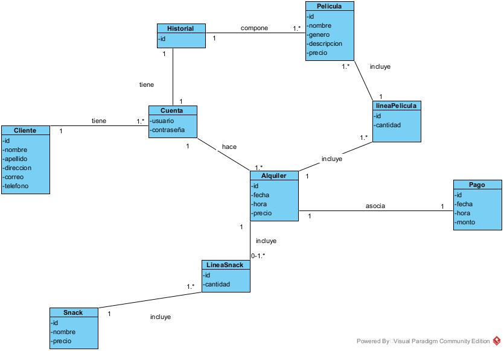

# Proyecto MiPelícula

Link a la página desplegada: [https://proyecto-mi-pelicula.vercel.app/auth](https://proyecto-mi-pelicula.vercel.app/auth)

---

## Tabla de Contenidos

- [Descripción](#descripción)
- [Instalación y Uso](#instalación-y-uso)
- [Tecnologías usadas en el Proyecto](#tecnologías-usadas-en-el-proyecto)
- [Uso de IA](#uso-de-ia)
- [Elementos usados durante el desarrollo del proyecto](#Elementos-usados-durante-el-desarrollo-del-proyecto)

---

## Descripción


En un mundo alterno al nuestro, el streaming fracasa y el formato físico sigue imponiéndose en el cine. ¿Cómo sería alquilar una película física hoy en día?

El proyecto consiste en una página web para alquilar películas físicas, contemplando distintos planes y plazos de alquiler.

---


## Instalación y Uso

### Instalación
1) Descarga el proyecto ya sea mediante GitHub o por zip
2) Abrir una terminal y acceder a la raíz del proyecto. Allí ejecutar el comando:

```bash
npm install --legacy-peer-deps
```

3) Crear un archivo .env.local en la raíz del proyecto con las siguientes variables:

```
NEXT_PUBLIC_SUPABASE_URL=tu_url_de_supabase
NEXT_PUBLIC_SUPABASE_ANON_KEY=tu_clave_anonima_de_supabase
```

Estas son las claves de tu Supabase

Para el sistema de correo es opcional, funciona el código pero no recibirás ningún correo al alquilar una película:

```
GMAIL_USER=tu_correo@gmail.com
GMAIL_APP_PASSWORD=xxxx xxxx xxxx xxxx
```

4) En Supabase ejecutar el siguiente código:

```sql
-- ══════════════════════════════════════════════
-- 1. TABLAS
-- ══════════════════════════════════════════════

create table "Cliente" (
  "idCliente"   bigint generated always as identity primary key,
  auth_id       uuid unique references auth.users(id) on delete cascade,
  nombre        text not null,
  apellido      text not null,
  correo        text not null,
  telefono      text,
  direccion     text,
  foto_perfil   text
);

create table "Cuenta" (
  "idCliente"  bigint primary key references "Cliente"("idCliente") on delete cascade,
  usuario      text unique not null
);

create table pelicula (
  id          bigint generated always as identity primary key,
  nombre      text not null,
  genero      text not null,
  descripcion text,
  precio      numeric(10,2) not null,
  duracion    int,
  imagen_url  text
);

create table snack (
  id          bigint generated always as identity primary key,
  nombre      text not null,
  precio      numeric(10,2) not null,
  imagen_url  text
);

create table alquiler (
  id                bigint generated always as identity primary key,
  cliente_id        bigint not null references "Cliente"("idCliente") on delete cascade,
  direccion_entrega text not null,
  fecha_envio       date not null,
  fecha_devolucion  date not null,
  precio_total      numeric(10,2) not null,
  pelicula_ids      bigint[] not null,
  created_at        timestamptz default now()
);

create table linea_snack (
  alquiler_id  bigint not null references alquiler(id) on delete cascade,
  snack_id     bigint not null references snack(id),
  cantidad     int not null,
  primary key (alquiler_id, snack_id)
);

create table pago (
  id           bigint generated always as identity primary key,
  alquiler_id  bigint not null references alquiler(id) on delete cascade,
  monto        numeric(10,2) not null,
  created_at   timestamptz default now()
);


-- ══════════════════════════════════════════════
-- 2. RPC: registrar_cliente (usado en el registro)
-- ══════════════════════════════════════════════

create or replace function registrar_cliente(
  p_auth_id  uuid,
  p_nombre   text,
  p_apellido text,
  p_correo   text,
  p_telefono text,
  p_usuario  text
)
returns void
language plpgsql
security definer
as $$
declare
  v_id bigint;
begin
  insert into "Cliente"(auth_id, nombre, apellido, correo, telefono)
  values (p_auth_id, p_nombre, p_apellido, p_correo, p_telefono)
  returning "idCliente" into v_id;

  insert into "Cuenta"("idCliente", usuario)
  values (v_id, p_usuario);
end;
$$;


-- ══════════════════════════════════════════════
-- 3. ROW LEVEL SECURITY
-- ══════════════════════════════════════════════

alter table "Cliente"    enable row level security;
alter table "Cuenta"     enable row level security;
alter table alquiler     enable row level security;
alter table linea_snack  enable row level security;
alter table pago         enable row level security;

create policy "cliente_own" on "Cliente"
  for all using (auth_id = auth.uid());

create policy "cuenta_own" on "Cuenta"
  for all using (
    "idCliente" = (select "idCliente" from "Cliente" where auth_id = auth.uid())
  );

create policy "alquiler_own" on alquiler
  for all using (
    cliente_id = (select "idCliente" from "Cliente" where auth_id = auth.uid())
  );

create policy "linea_snack_own" on linea_snack
  for all using (
    alquiler_id in (
      select id from alquiler
      where cliente_id = (select "idCliente" from "Cliente" where auth_id = auth.uid())
    )
  );

create policy "pago_own" on pago
  for all using (
    alquiler_id in (
      select id from alquiler
      where cliente_id = (select "idCliente" from "Cliente" where auth_id = auth.uid())
    )
  );


-- ══════════════════════════════════════════════
-- 4. DATOS DE EJEMPLO (peliculas y snacks)
-- ══════════════════════════════════════════════

insert into pelicula (nombre, genero, descripcion, precio, duracion, imagen_url) values
  ('El Padrino',      'Drama',           'La historia de la familia Corleone.',       1500.00, 175, null),
  ('Interstellar',    'Ciencia Ficción', 'Un viaje a través del espacio-tiempo.',     1800.00, 169, null),
  ('Pulp Fiction',    'Thriller',        'Historias entrelazadas en Los Ángeles.',    1400.00, 154, null),
  ('El Rey León',     'Animación',       'El ciclo de la vida en la sabana africana.',1200.00, 88,  null),
  ('Inception',       'Acción',          'Un ladrón que roba secretos de los sueños.',1700.00, 148, null),
  ('La La Land',      'Romance',         'Dos artistas persiguen sus sueños en L.A.',1300.00, 128, null);

insert into snack (nombre, precio, imagen_url) values
  ('Pochoclo dulce',  800.00, null),
  ('Pochoclo salado', 800.00, null),
  ('Coca-Cola 500ml', 600.00, null),
  ('Agua mineral',    400.00, null),
  ('Chocolates',      950.00, null),
  ('Papas fritas',    750.00, null);
```

5) En Supabase crear el bucket público de imágenes de perfil con el nombre "avatares"


---

### Uso

1) Abrir una terminal y acceder a la raíz del proyecto. Allí ejecutar el comando:

```bash
npm run dev
```

2) Abrir un navegador a su elección e ingresar esta dirección: http://localhost:3000

---


## Tecnologías usadas en el Proyecto

El proyecto está programado principalmente en:

**TypeScript**: Por su compatibilidad con JavaScript y poder agregar tipado estático.

**Next.js**: Para navegar entre páginas de forma sencilla mediante App Router y estructurar el proyecto.

**CSS Modules**: Por los estilos del frontend.

**Vitest**: Para realizar los tests unitarios.

**Gmail SMTP**: Para el sistema de envío de emails. Considero que es el más accesible para fines de este prototipo.

**Supabase**: Como base de datos en la nube por su implementación sencilla.

También se utilizó **Vercel** para el deploy del proyecto.

---

## Uso de IA

Para este proyecto se han usado dos IAs. Claude Code (Claude Pro) para el desarrollo, y Gemini como consultor externo.

**Claude Pro**
A lo largo del proyecto he utilizado una función que pocos conocen que es el modo "Plan". Este modo consiste en pasar un prompt detallando la solución que ya previamente diseñaste y la IA, sin tocar el código, te presenta los cambios necesarios para implementarlo. Una vez que reviso su respuesta y la corrijo de ser necesario, le mando confirmación y la IA ejecuta al pie de la letra el plan. De esta forma siempre mantienes control de lo que se hará antes de que se realice.
Posteriormente a esto también reviso si todo funciona. Por lo general, según mi experiencia, si el diseño está bien, el código lo estará. Pero ante las dudas, siempre pruebo lo que se escribe.

Un ejemplo de este uso fue el siguiente:
Una vez que ya diseñé por completo cómo sería el sistema de alquiler de películas, especifiqué la función. El plan que se generó fue directo, teniendo que corregir problemas técnicos como la correcta conexión de Supabase, cosa que superaba el alcance de la IA por la falta de contexto.


**Gemini**

Se utilizó Gemini en forma de consultora para determinar si el proyecto tomaba buen rumbo o mal rumbo. Fue más un compañero de trabajo que ayudó a enseñarme tecnologías que tal vez no conocía y eran mejores para el proyecto. Por ejemplo el uso de Gmail SMTP para el desarrollo del sistema de emails.

---


## Elementos usados durante el desarrollo del proyecto

### Diagrama de Dominio



---

### Tests

Para ejecutar los tests unitarios:

```bash
npm test
```

---

### Requisitos Funcionales

- **Crear cliente:** El usuario crea una sesión ingresando datos personales: nombre completo, correo electrónico, nombre de usuario y contraseña.
- **Iniciar sesión:** El usuario accede a su cuenta con sus credenciales.
- **Alquilar película:** El cliente selecciona las películas que desea y las agrega al carrito. Luego elige un plan de pago y, opcionalmente, agrega snacks al pedido. Ingresa sus datos de pago, verifica la compra y la confirma. El pago se genera y se registra en el sistema.
- **Consultar Historial:** El cliente visualiza el historial de películas que alquiló.
- **Actualizar perfil**: El usuario puede actualizar nombre de usuario, teléfono, dirección, contraseña y foto de perfil

---

### Requisitos No Funcionales

- El sistema debe mostrar únicamente las películas alquiladas por el usuario autenticado.
- El sistema debe integrarse con Supabase para almacenar los datos de usuarios, pagos y películas disponibles.
- El sistema debe permitir enviar emails cuando se alquila una película

---

### Caso de Uso

**CrearCliente**
Flujo Normal:
0.	El usuario ingresa “Crear sesión”
1.	El sistema carga el CU
2.	El usuario ingresa su nombre, apellido, teléfono, email, nombre de usuario y la contraseña. Luego presiona confirmar
3.	El sistema carga los datos a la base de datos de Cliente en Supabase y finaliza el caso de uso
[Conectar sistema Supabase]

Flujo Alterno:
A0: Cancelar
*.1) El cliente presiona cancelar
*.2) El sistema termina el caso de uso sin guardar

A1: Campo incompleto
	2.1 El usuario omite un campo
	2.2 El sistema muestra un cartel rojo con el campo que debe completar
A2: Formato no válido
	2.1 El usuario ingresa un campo con carácter no válido
	2.2 El sistema muestra un cartel rojo indicando que el campo está mal escrito y que debe contener.

**AlquilarPelicula**
Flujo Normal:
0.	El cliente ingresa “Alquilar película”
1.	El sistema carga el CU mostrando por imagen todas las películas disponibles
2.	El cliente selecciona las películas que desea alquilar y presiona “confirmar”.
3.	El sistema consulta la fecha de envío y la cantidad de días que desea poseer las películas
4.	El cliente selecciona la fecha y la cantidad de días.
5.	El sistema carga una consulta para agregar snack
6.	El cliente selecciona, si lo desea, qué snacks y cuántos agregar
7.	El sistema calcula el total y lo muestra por pantalla
8.	El cliente presiona “Confirmar”
9.	El sistema muestra el recibo de la compra y guarda los datos en la base de datos. Termina el caso de uso

Flujo Alterno:
A0: Cancelar
*.1) El cliente presiona cancelar
*.2) El sistema termina el caso de uso sin guardar

A1: Fecha inválida
4.1 El cliente ingresa fecha inválida
4.2 El sistema muestra un cartel indicando que la fecha es inválida

A2: Película vacía
	2.1 El cliente no selecciona ninguna película y presiona “Confirmar”
	2.2 El sistema indica por cartel que debe seleccionar alguna película 